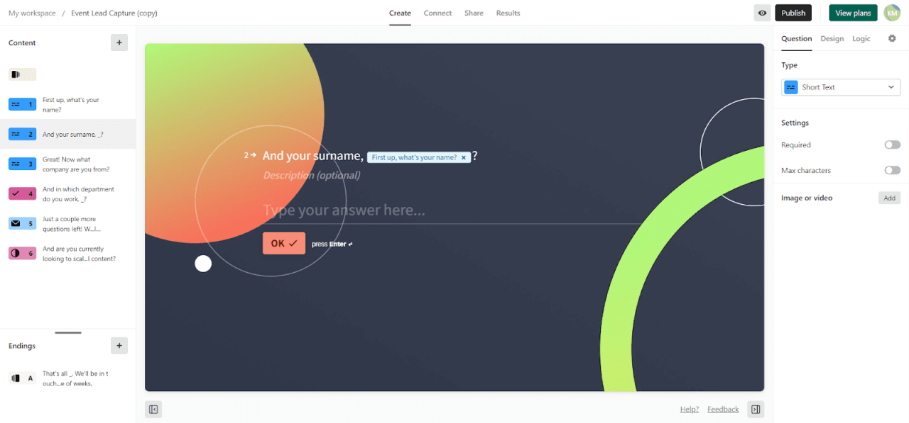

## This project aims to show visualization of extension development to user

### Need to develop:
1. **Processing loaded project on the backend and visualize it on frontend**
2. **Option to create a some structure of project**
 - **First example is extension architecture early developed**
 - **Use for it module-service-controller architecture**
 - **Need to transfer some functionality as feature disabling etc**

### Development Plan:

#### **Block 1: Project Initialization and Visualization**
1. **User Project Initialization:**
 - **Task:** Implement a user-friendly project initialization process.
 - **Subtask:** Allow users to specify project details.
 - **Subtask:** Initialize the project on the backend.

2. **Visualization on the Frontend:**
 - **Task:** Develop backend processing to visualize the loaded project on the frontend.
 - **Subtask:** Create a user interface to display project details.
 - **Subtask:** Ensure real-time updates upon project changes.

#### **Block 2: Project Structure and Extension Architecture**
3. **Project Structure Creation:**
 - **Task:** Implement an option to define the structure of the project.
 - **Subtask:** Provide examples of project structures.
 - **Subtask:** Allow users to choose or customize project structures.

4. **Extension Architecture Visualization:**
 - **Task:** Visualize extension architecture using the module-service-controller approach.
 - **Subtask:** Integrate module-service-controller architecture.
 - **Subtask:** Transfer key functionalities such as feature disabling to enhance visualization.

#### **Block 3: Synchronization and Code Editing**
5. **Synchronization Functionality:**
 - **Task:** Develop a synchronization function to track changes in the user's project.
 - **Subtask:** Enable remote updates of the project in the Next.js application.

6. **Code Editor Integration:**
 - **Task:** Implement an in-app code editor for remote project editing.
 - **Subtask:** Ensure synchronization upon user-initiated code changes.
 - **Subtask:** Provide a seamless user experience for editing and saving code.

#### **Block 4: GitHub/GitLab Integration**
7. **Integration with GitHub/GitLab:**
 - **Task:** Add functionality to load projects directly from GitHub or GitLab repositories.
 - **Subtask:** Allow users to choose branches and commits for project retrieval.
 - **Subtask:** Explore automatic or manual update options for projects from repositories.

8. **Local Copy Creation:**
 - **Task:** Consider automating the creation of a local copy when loading projects from repositories.

#### **Block 5: Testing and Refinement**
9. **Testing:**
 - **Task:** Conduct thorough testing of each implemented feature and functionality.
 - **Subtask:** Address and resolve any identified issues or bugs.

10. **Refinement:**
 - **Task:** Refine the user interface and overall user experience based on testing feedback.
 - **Subtask:** Optimize performance and responsiveness of the application.

## **Reference to design idea (but dark theme is going to be used )**

